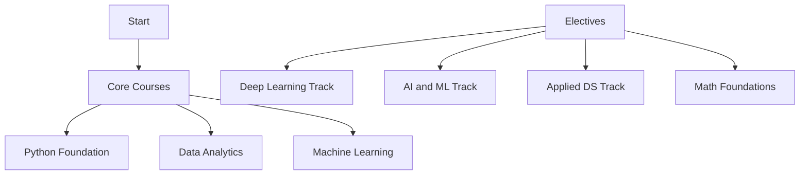

A structured learning path based on NPTEL's Data Science curriculum, designed to provide a comprehensive education in Data Science fundamentals and advanced concepts.

## 🎯 Domain Overview

This curriculum spans a minimum of 60 weeks and consists of:
- 3 mandatory core courses
- 3 elective courses from a pool of specialized topics
- Courses from prestigious Indian institutions like IIT Madras, IIT Kharagpur, and others

## 📚 Core Courses

### 1. Python Programming (Choose one)
- **Python for Data Science** (4 weeks)
  - Instructor: Prof. Ragunathan Rengasamy, IIT Madras
  - Basic Python concepts focused on data science applications
  
- **Programming, Data Structures and Algorithms in Python** (8 weeks)
  - Instructor: Prof. Madhavan Mukund, Chennai Mathematical Institute
  - Comprehensive coverage of programming fundamentals and DSA

### 2. Data Analytics Foundation (Choose one)
- **Introduction to Data Analytics** (8 weeks)
  - Instructors: Prof. Nandan Sudarsanam, Prof. Balaraman Ravindran
  - IIT Madras

- **Data Science for Engineers** (8 weeks)
  - Instructors: Prof. Ragunathan Rengasamy, Prof. Shankar Narasimhan
  - IIT Madras

- **Data Analytics with Python** (12 weeks)
  - Instructor: Prof. A. Ramesh
  - IIT Roorkee

### 3. Machine Learning Fundamentals (Choose one)
- **Introduction to Machine Learning - IITKGP** (8 weeks)
  - Instructor: Prof. Sudeshna Sarkar
  - IIT Kharagpur

- **Introduction to Machine Learning - IITM** (12 weeks)
  - Instructor: Prof. Balaraman Ravindran
  - IIT Madras

## 🔍 Elective Courses

Choose any 3 from the following specialized tracks:

### Deep Learning Track
1. **Deep Learning** (12 weeks)
   - Prof. Mitesh Khapra, IIT Madras
2. **Deep Learning for Computer Vision** (12 weeks)
   - Prof. Vineeth N Balasubramanian, IIT Hyderabad

### AI and ML Track
1. **Reinforcement Learning** (12 weeks)
   - Prof. Balaraman Ravindran, IIT Madras
2. **Artificial Intelligence Search Methods** (12 weeks)
   - Prof. Deepak Khemani, IIT Madras
3. **Knowledge Representation and Reasoning** (12 weeks)
   - Prof. Deepak Khemani, IIT Madras

### Applied Data Science Track
1. **Natural Language Processing** (12 weeks)
   - Prof. Pawan Goyal, IIT Kharagpur
2. **Computer Vision** (12 weeks)
   - Prof. Jayanta Mukhopadhyay, IIT Kharagpur
3. **Business Intelligence & Analytics** (12 weeks)
   - Prof. Saji K Mathew, IIT Madras

### Mathematical Foundations Track
1. **Probability for Computer Science** (8 weeks)
   - Prof. Nitin Saxena, IIT Kanpur
2. **Linear Programming and its Applications** (8 weeks)
   - Prof. Rajat Mittal, IIT Kanpur

## 📊 Specialized Tools and Technologies
- **Practical Machine Learning with Tensorflow** (8 weeks)
- **Advanced R Programming for Data Analytics** (12 weeks)
- **Learning Analytics Tools** (12 weeks)

## 🎓 Learning Path Structure

## 🔧 Prerequisites
- Basic programming knowledge
- Mathematics fundamentals (Statistics, Linear Algebra, Calculus)
- Comfortable with Python programming language

## 📝 Assessment and Certification
- Course-specific assignments and projects
- Final examinations for each course
- Certification upon successful completion of required courses

## 🌐 Resources
- NPTEL Course Portal: [https://nptel.ac.in/](https://nptel.ac.in/)
- https://nptel.ac.in/domains/discipline/106?course=106_1
- Support Email: support@nptel.iitm.ac.in

## 📅 Important Notes
- Courses are typically offered in Jul-Dec semester
- Check NPTEL website for specific course schedules
- Some courses may have prerequisites
- Course availability may vary by semester

---
*Last Updated: 2024*  
*For the most current information, please refer to the official NPTEL website.*
